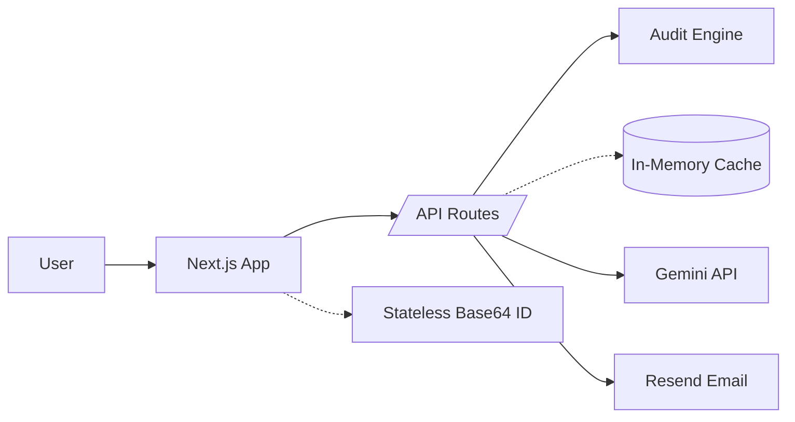

# Architecture

## System Diagram

## Data Flow
1. **Input**: User submits the spend form.
2. **Audit**: `POST /api/audit` validates input and runs the deterministic audit engine.
3. **Stateless ID**: The result is serialized and Base64-encoded into a "Public ID".
4. **Persistence**: The audit is cached in-memory (for fast local lookups) but the *encoded ID itself* contains all the data required for sharing.
5. **Summary**: UI calls `POST /api/summary` for the AI summary (Gemini 1.5 Flash).
6. **Lead Capture**: `POST /api/leads` captures email, stores it in memory, and triggers an email via Resend.
7. **Public Share**: `GET /audit/[encoded_id]` decodes the Base64 ID to render the page, ensuring 100% availability even without a database.

## Why This Stack
- **Next.js + TypeScript**: Rapid iteration and App Router for seamless API/UI integration.
- **Stateless Persistence**: Using Base64-encoded URLs removes the need for a database, making deployment (e.g., Vercel) trivial and extremely cost-effective.
- **Gemini 1.5 Flash**: Optimized for fast, accurate financial summaries.

## Scale to 10k Audits/Day
- The stateless architecture already handles scale effortlessly as there is no database bottleneck.
- For lead management at scale, move from in-memory to a persistent KV store or Postgres.
- Add structured logging and metrics for conversion tracking.
