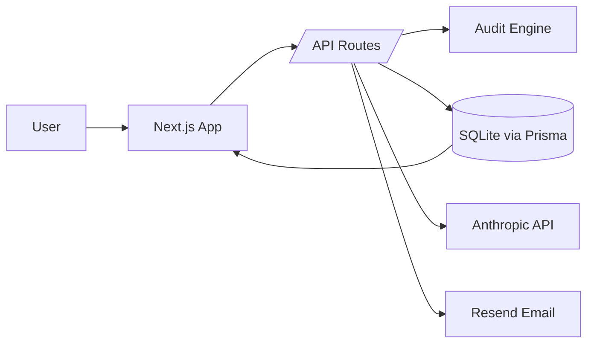

# Architecture

## System Diagram

## Data Flow
1. User submits the spend form in the client.
2. `POST /api/audit` validates input and runs the deterministic audit engine.
3. The audit result is stored in SQLite via Prisma (JSON serialized).
4. The UI renders the on-screen audit and calls `POST /api/summary` for the 100-word AI summary.
5. If the user submits email, `POST /api/leads` stores the lead and sends a confirmation email.
6. `GET /audit/[id]` is a public share page that renders by audit ID with no PII.

## Why This Stack
- Next.js + TypeScript for rapid iteration, App Router, and reliable SSR for the shareable URL.
- Prisma + SQLite for local persistence with a clean path to Postgres later.
- Anthropic for the required AI summary feature and deterministic fallback on failure.

## Scale to 10k Audits/Day
- Move SQLite to Postgres with connection pooling.
- Put summary generation and email sends onto a queue.
- Add read replicas and cache for hot audit pages.
- Add structured logging, metrics, and alerting.
